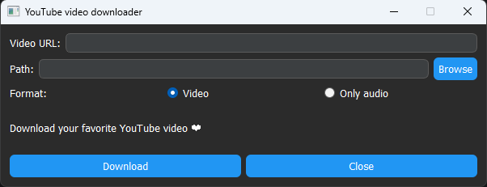

# 🎥 YouTube Video Downloader
A simple desktop application built using PyQt5 and pytubefix to download YouTube videos or extract audio from YouTube links through an intuitive graphical interface.

## 🎮 Preview


## 🚀 Features
* Download videos in the highest available resolution
* Download audio only
* Simple and intuitive desktop interface
* Select custom download directory
* Background downloading using threads (non-blocking UI)
* Success and error notifications
* Dark theme interface

## 🛠️ Technologies
* **PyQt5** - Desktop GUI framework
* **pytubefix** - YouTube downloading library

## ⚙️ Requirements
* Python 3.10+ (recommended)

## ▶️ Installation
### 1. Clone the repository
```bash
git clone https://github.com/fellipe27/youtube-video-downloader.git
cd youtube-video-downloader
```

### 2. Create a virtual environment
```bash
python -m venv .venv
source .venv/bin/activate   # Linux/Mac
.venv\Scripts\Activate.ps1  # Windows
```

### 3. Install dependencies
```bash
pip install -r requirements.txt
```

## ▶️ Running the application
```bash
python main.py
```

## 🖥️ Usage
1. Paste a YouTube video URL.
2. Choose the destination folder.
3. Select one of the available formats:
   * **Video**
   * **Only audio**
4. Click **Download**.
5. Wait until the download finishes.

## 🗂️ Project structure
```text
youtube-video-downloader/
    - main.py               # Application entry point
    - requirements.txt      # Project dependencies
    - docs/                 # Application preview 
```

## 📄 License
MIT

## 👨‍💻 Author
Developed by **[Paulo Fellipe](https://github.com/fellipe27)**
